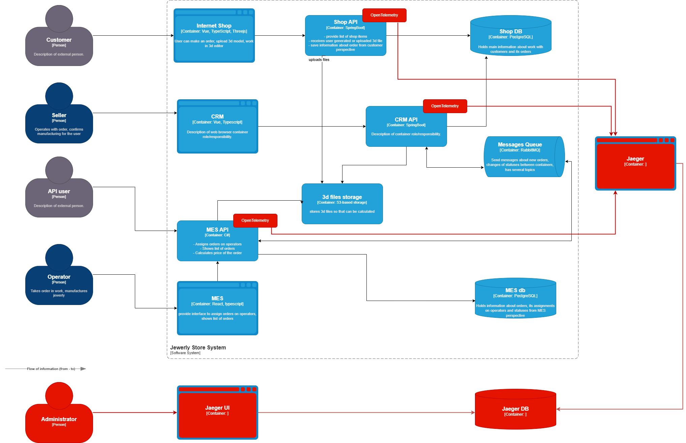

## Архитектурное решение по трейсингу
  
# Мотивация
    Добавление трейсинга позволит:
    •	Понять, где заказ зависает.
    •	Оптимизировать цепочку обработки заказов.
    •	Анализировать причины отказов.
    •	Улучшить SLA за счет быстрого обнаружения проблем.
# Метрики:
    •	Время прохождения заказа по системе.
    •	Количество заказов в подвешенном состоянии.
    •	Среднее время ожидания в очереди.
    •	Количество ошибок при обработке заказов.
# Предлагаемое решение
    
    Для трейсинга будет использована OpenTelemetry с интеграцией в Jaeger для распределенного трейсинга. Ключевые компоненты:
    •	Инструментирование сервисов через OpenTelemetry SDK.
    •	Настройка экспорта трейсов в Jaeger.
    •	Визуализация цепочек обработки заказов.
    •	Интеграция с существующим мониторингом (Prometheus/Grafana/ElasticSearch).
# Компромиссы
    •	Проприетарные системы могут не поддерживать OpenTelemetry.
    •	Высокая нагрузка на сеть и хранилище трейсов при увеличении количества заказов.
    •	Возможность ложных срабатываний при анализе зависших заказов.
# Аспекты безопасности
    •	Аутентификация и авторизация доступа к системе трейсинга.
    •	Ограничение доступа к трейсам на уровне ролей.
    •	Шифрование данных в передаче и хранилище.
# Автоматический мониторинг и алертинг
    Настроим автоматическое отслеживание задержек в обработке заказов. Если заказ находится в одном состоянии дольше заданного времени:
    •	Оповещение в корпоративный чат.
    •	Создание тикетов в таск менеджере.
    •	Автоматическая диагностика проблем.