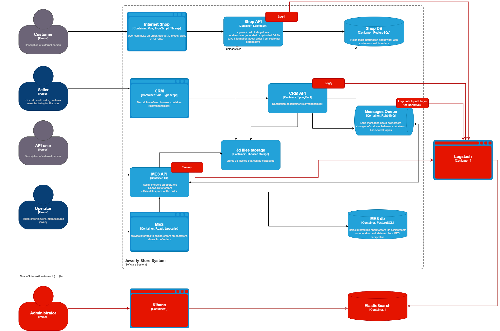

## Архитектурное решение по логированию

# Мотивация
    В настоящее время диагностика проблем в системе компании затруднена, 
так как ошибки и нестандартные ситуации разбираются на основании сообщений от клиентов. 
Это приводит к следующим проблемам:
    •	Длительное время поиска и устранения ошибок.
    •	Высокая нагрузка на поддержку и разработчиков.
    •	Отсутствие объективных данных для анализа причин инцидентов.
    •	Сложность выявления системных проблем и аномалий в работе сервисов.
    Внедрение логирования позволит:
    •	Сократить время диагностики инцидентов.
    •	Снизить нагрузку на поддержку и разработку.
    •	Улучшить мониторинг состояния системы.
    •	Обеспечить аудит критических операций.
    Бизнес и технические метрики
    1.	Среднее время диагностики инцидента (MTTR).
    2.	Количество обращений в поддержку, связанных с неполадками системы.
    3.	Количество ошибок в логах (HTTP 5xx, исключения в коде).
    4.	Производительность системы при обработке логов.
    5.	Количество аномалий, выявленных в логах.
# Какие логи нужно собирать
    Логирование будет реализовано на нескольких уровнях:
    Уровень INFO (информационные события)
    •	Изменение статуса заказа: идентификатор заказа, пользователь, время изменения, новое состояние.
    •	Авторизация пользователя: идентификатор пользователя, IP-адрес, успешность попытки.
    •	Взаимодействие с внешними сервисами: сервис, время запроса, время ответа, код состояния.
    •	Обновление каталога товаров: количество обновленных товаров, идентификатор операции.
    Уровень ERROR (ошибки)
    •	Ошибки выполнения бизнес-логики.
    •	Ошибки взаимодействия с внешними сервисами (таймауты, неверные данные).
    •	Ошибки базы данных (ошибки соединения, превышение таймаута запросов).
    Уровень DEBUG (отладочные логи)
    •	Включается при необходимости для анализа сложных проблем.
    •	Записывает промежуточные данные обработки запросов.
    Уровень WARN (логи предупреждений)
    •	Предупреждения выполнения бизнес-логики.
    •	Предупреждения взаимодействия с внешними сервисами.
    •	Предупреждения базы данных.
# Приоритетность логирования и трейсинга
Так как команда не сможет сразу реализовать логирование и трейсинг для всех систем, приоритет будет отдан следующим:
    1.	API-шлюз (логирование всех входящих запросов, трейсинг задержек обработки API-запросов).
    2.	Сервис обработки заказов (логирование изменений состояния заказов, трейсинг этапов обработки).
    3.	Сервис взаимодействия с платежными системами (логирование успешных и неуспешных платежей, ошибок).
    4. Предлагаемое решение
    Логирование будет реализовано с помощью EFK-стека (Elasticsearch + Fluentd + Kibana):
    •	Fluentd собирает логи из сервисов и отправляет их в Elasticsearch.
    •	Kibana используется для визуализации и анализа логов.
    •	Интеграция с Prometheus/Grafana для мониторинга аномалий.
    Политика безопасности
    •	Логи с чувствительными данными (например, персональные данные пользователей) будут анонимизированы.
    •	Доступ к логам будет разграничен по ролям (разработчики, администраторы, безопасность).
    •	Логи ошибок будут храниться дольше, чем отладочные логи.
    Политика хранения
    •	Хранение логов API – 30 дней.
    •	Хранение логов ошибок – 90 дней.
    •	Архивирование логов старше 90 дней в холодное хранилище.
# Анализ логов и алертинг
    •	Настроен алертинг по аномалиям (например, резкий рост ошибок HTTP 500).
    •	Оповещение в корп. чат при критических сбоях.
    •	Автоматический анализ логов на основе машинного обучения

# Предлагаемое решение

- ELK
- Библиотеки log4j, Serilog, Logstash Input Plugin for RabbitMQ для формирования логов

